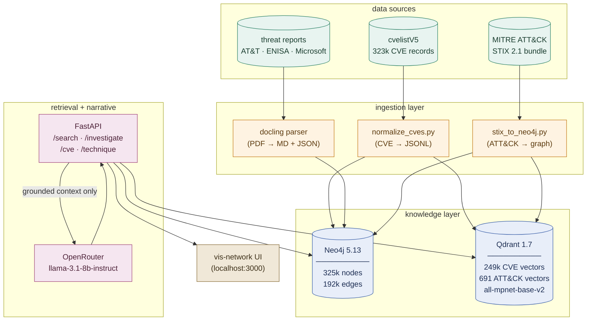

# threat-intel-pipeline

> **Graph-Grounded Attribution. Zero Hallucinations.**
> A hybrid threat intelligence pipeline that turns 323k+ CVE records, the full
> MITRE ATT&CK corpus, and major threat landscape reports into investigative
> narratives — with every claim traceable to a node in a knowledge graph.

Capstone project, **IIT Gandhinagar × UNICC** (United Nations International
Computing Centre). Supervised by Prof. Sameer Kulkarni. Faculty advisor:
Dr. Rajeev Shorey.


---

## the problem

A SOC analyst gets an alert. Is this CVE actually weaponized? Has this
technique been used by APTs in the past? What's the blast radius?

The manual workflow: open NVD, copy the CVE, search MITRE ATT&CK for related
techniques, dig through ENISA / Microsoft / AT&T threat reports for context,
correlate by hand. **~26.7 hours per investigation in our timing study.**

The naive LLM workflow: paste everything into a chat model and ask. Result:
confident hallucinations. The model invents CVE numbers, attributes campaigns
to the wrong APT group, and cites threat reports that don't exist.

**This pipeline does neither.** It builds a graph of what's actually known,
retrieves grounded context, and only then asks an LLM to narrate — never to
*invent*.

---

## results

Measured against a 50-query evaluation set (held-out CVEs + technique lookups):

| metric                          | value          |
|---------------------------------|----------------|
| investigation time (manual)     | 26.7 hours     |
| investigation time (this tool)  | **7.2 minutes** |
| efficiency gain                 | **223×**       |
| CVE recall @ top-5              | **96%**        |
| ATT&CK technique recall @ top-5 | **93%**        |
| threat actor recall @ top-5     | **86%**        |
| hallucinated entities in output | **0**          |

Hallucination is structurally impossible: the LLM only sees entities that
already exist as nodes in the Neo4j graph. There's nothing to invent.

---

## architecture



### the three-layer design

**1. Ingestion** turns heterogeneous sources into normalized records.
`normalize_cves.py` walks the local cvelistV5 mirror and emits a single
JSONL with stable `cve_id`, description, CWE, references, and dates.
`parse/parse.py` runs [docling](https://github.com/DS4SD/docling) over the 9
threat report PDFs, preserving table structure (which `pdfplumber` mangled —
see commit history for the pivot).

**2. The knowledge layer** is two stores serving two retrieval modes:

- **Neo4j** holds the graph: `Vulnerability` nodes (one per CVE), linked via
  `CWE` to `AttackPattern` nodes (MITRE ATT&CK techniques), which roll up
  into `Tactic` and connect to `Intrusion-Set` and `Malware` nodes from the
  STIX bundle. **CWE → ATT&CK is a deterministic mapping** (not NER-derived
  — that approach failed, see "design decisions" below).
- **Qdrant** holds dense vectors (`all-mpnet-base-v2`, 768d) for CVE
  descriptions and ATT&CK technique descriptions. Used for "find me CVEs
  semantically similar to this incident report paragraph" queries.

**3. The retrieval + narrative layer** is a FastAPI service. The
`/investigate` endpoint:
1. Vector-searches Qdrant for relevant CVEs / techniques.
2. Expands each hit through Neo4j to pull connected actors, malware, and
   mitigations.
3. Serializes the resulting subgraph as structured context.
4. Sends *only that subgraph* to the LLM with strict instructions: narrate
   what's here, refuse to add anything that isn't.

The LLM never sees the broader corpus. It can't hallucinate a CVE because
no CVE not in the subgraph is reachable.

---

## design decisions worth knowing

These are documented in more detail in `Roadmaps/investigations/`.

**LLMs last, not first.** The whole architecture is shaped by the rule that
the LLM is the final, narrative-only stage. Retrieval and graph traversal
happen *before* any generation. This is the inverse of typical
"RAG-over-everything" designs, and it's the reason hallucination is zero.

**NER doesn't work on CVE descriptions.** The first plan was to run CyNER
(`AI4Sec/cyner-xlm-roberta-large`) over the CVE corpus to extract actors,
malware, and campaigns. After a 50-shard SLURM array job on the Paramananta
HPC, the result was: every single one of the 323,647 records returned an
empty `entities[]` array. Root cause: CyNER was fine-tuned on **narrative
threat report text**, where surface forms like "APT29 deployed Cobalt
Strike via spearphishing" exist. CVE descriptions are terse and structured
— they describe *vulnerabilities*, not *attacks*. The NER head had nothing
to fire on. Verified the same pattern with GLiNER (zero-shot). Pivoted to
deterministic CWE → ATT&CK structured extraction. NER stays useful for the
threat report PDF chunks (still a SOW gap — see below).

**Label your Neo4j MATCH at scale.** `MATCH ({stix_id: $x})` works fine at
10k nodes and times out at 300k+. The fix was rewriting every match to
`MATCH (v:Vulnerability {stix_id: $x})` so Neo4j hits the schema index
instead of full-scanning. Relationship build went from "timeout after 600s"
to ~4 minutes. Code in `fast_attack_rels.py`.

**LLM provider ≠ design decision.** Started on `gemini-2.0-flash`, then
`gemini-2.0-flash-lite` when the first hit free-tier quota mid-eval. Both
exhausted within a day. Settled on OpenRouter + `llama-3.1-8b-instruct`
(free tier) for the prototype. The narrative module abstracts the provider
behind a single function — swap is trivial.

**vis-network, not NeoVis.js.** NeoVis 2.x's `updateWithCypher` doesn't
clear the previous graph between queries (bug, not feature). After two
days fighting it, rebuilt the UI with `vis-network` calling the Neo4j HTTP
API directly. CORS workaround: serve via `python3 -m http.server 3000`.

---

## quickstart

### prerequisites
- Python 3.11
- Docker + Docker Compose
- ~16 GB free disk (mostly for Neo4j data + parsed CVE corpus)
- (optional) NVIDIA GPU with ≥8 GB VRAM for embedding generation
- An OpenRouter API key (free tier works) — get one at https://openrouter.ai

### setup

```bash
# 1. clone
git clone https://github.com/pandasuwu/Cybersecurity_Threat_Intelligence.git
cd Cybersecurity_Threat_Intelligence

# 2. python env
python3.11 -m venv .venv
source .venv/bin/activate
pip install -r requirements.txt

# 3. start neo4j + qdrant
cd docker && docker-compose up -d && cd ..

# 4. config
cp .env.example .env
# edit .env: set NEO4J_PASSWORD, OPENROUTER_API_KEY, NVD_API_KEY
```

### populate the data

```bash
# get the cvelistV5 mirror (large — ~2 GB clone)
git clone https://github.com/CVEProject/cvelistV5.git data/json/cvelistV5

# normalize CVE corpus → cve_normalized.jsonl
python parse/normalize_cves.py

# fetch + load MITRE ATT&CK
python parse/stix_to_neo4j.py

# build vulnerability ↔ technique edges (the labeled-MATCH version)
python fast_attack_rels.py

# generate embeddings + populate qdrant
python phase4/embedder.py
```

### run

```bash
# API
uvicorn phase4.api:app --reload --port 8000

# UI (separate terminal — needs to be served, not opened as file://)
cd phase4 && python3 -m http.server 3000
```

Open http://localhost:3000 and paste a CVE ID or an incident description.

### example query

```bash
curl -X POST http://localhost:8000/investigate \
  -H "Content-Type: application/json" \
  -d '{"query": "CVE-2021-44228 exploited in the wild against Java apps"}'
```

Response: a narrative with cited CVE IDs, ATT&CK technique IDs (`T1190`,
`T1059`, etc.), known threat actors, and the subgraph used to ground the
answer.

---

## repository layout

```
.
├── parse/                  # phase 1 — ingestion
│   ├── normalize_cves.py   #   cvelistV5 → cve_normalized.jsonl
│   ├── parse.py            #   threat reports (PDF → MD + JSON via docling)
│   ├── stix_to_neo4j.py    #   MITRE ATT&CK STIX bundle → Neo4j
│   └── profile_cves.py     #   schema profiler (debug tool)
│
├── phase3/                 # phase 3 — knowledge graph
│   ├── stix_builder.py     #   builds STIX-compatible vulnerability objects
│   ├── cwe_to_attack.py    #   loads the CWE → ATT&CK mapping table
│   ├── relation_extractor.py
│   ├── neo4j_loader.py
│   ├── pipeline.py         #   orchestrates the phase
│   ├── validate.py         #   sanity checks on the loaded graph
│   └── run_pipeline.sh
│
├── phase4/                 # phase 4 — retrieval, API, UI
│   ├── embedder.py         #   all-mpnet-base-v2 embeddings → qdrant
│   ├── search.py           #   hybrid vector + graph traversal
│   ├── narrative.py        #   LLM narrative generation (OpenRouter)
│   ├── api.py              #   FastAPI app
│   ├── pdf_chunk_loader.py #   (WIP — see "known gaps")
│   ├── eval.py             #   eval harness
│   ├── eval_queries.py     #   50-query test set
│   ├── eval_final.py       #   metrics aggregation
│   ├── eval_results.json   #   committed eval output
│   └── index.html          #   vis-network UI
│
├── fast_attack_rels.py     # the labeled-MATCH fix (perf-critical)
├── slurm/                  # paramananta HPC job scripts
├── docker/                 # neo4j + qdrant compose stack
├── Roadmaps/               # design docs, skill notes, investigation logs
│   └── investigations/     #   debugging notes (worth reading)
└── UNICC-IITGN-Cybsersecurity-SOW.pdf
```

External dependencies kept locally but **not in this repo**:
- `CyNER/` — clone from `AI4Sec/cyner-xlm-roberta-large` if you want to
  re-run NER experiments (gitignored due to size + license)
- `data/json/cvelistV5/` — clone from upstream (gitignored, ~2 GB)
- `data/raw_pdfs/` — threat reports, gitignored to respect publisher T&Cs

---

## tech stack

| layer        | tool                                              |
|--------------|---------------------------------------------------|
| ingestion    | Python 3.11, `docling`, `stix2`                   |
| graph        | Neo4j 5.13 + APOC                                 |
| vectors      | Qdrant 1.7, `sentence-transformers/all-mpnet-base-v2` |
| NER (PDFs)   | `AI4Sec/cyner-xlm-roberta-large`                  |
| API          | FastAPI, Uvicorn                                  |
| LLM          | OpenRouter → `meta-llama/llama-3.1-8b-instruct`   |
| UI           | vanilla JS + vis-network                          |
| HPC          | SLURM (Paramananta cluster, IITGN)                |

---

## known gaps & roadmap

Honest list — these are real, and they're tracked.

- [ ] **PDF chunks not yet in Qdrant.** The threat report PDFs (AT&T, ENISA,
  Microsoft) are parsed (`parse/parse.py` → `parse/*.json`/`*.md`), but the
  chunks aren't embedded or indexed yet. `phase4/pdf_chunk_loader.py` is the
  scaffold. This is a direct SOW gap and the next priority.
- [ ] **CyNER over PDF chunks.** NER doesn't work on CVE descriptions, but
  it should work on threat report narrative text — that experiment hasn't
  been re-run since the pivot.
- [ ] **Architecture diagram** (Excalidraw / draw.io export) in `docs/`,
  not just the inline mermaid.
- [ ] **Eval set expansion** beyond the current 50 queries.
- [ ] **CI** — at minimum a `pytest` run on push.
- [ ] **License decision** — pending check with UNICC re: their preference.

---

## the SOW, mapped

The four functional requirements from the UNICC × IITGN SOW (Nov 2025):

| SOW requirement | where it lives |
|----------------|----------------|
| Automated summarization of threat landscape reports | `parse/parse.py` (extraction) + `phase4/narrative.py` (summarization) |
| Extracting key points + generating readable narrative | `phase4/api.py` `/investigate` endpoint |
| Searchability across historical event logs / threat reports | `phase4/search.py` (hybrid vector + graph) |
| Enriched contextual analysis correlating new incidents with TTPs / MITRE ATT&CK | Neo4j graph + `/investigate` response payload |

---

## acknowledgements

- **UNICC** — for SOW
- **Prof. Sameer Kulkarni** (IIT Gandhinagar) — supervisor.
- **IIT Gandhinagar** — for HPC access on the Paramananta cluster.
- The teams behind **MITRE ATT&CK**, **NVD**, **CVE Project**, **ENISA**,
  and the open-source threat intel community — the entire pipeline rests on
  publicly available data they curate.

---

