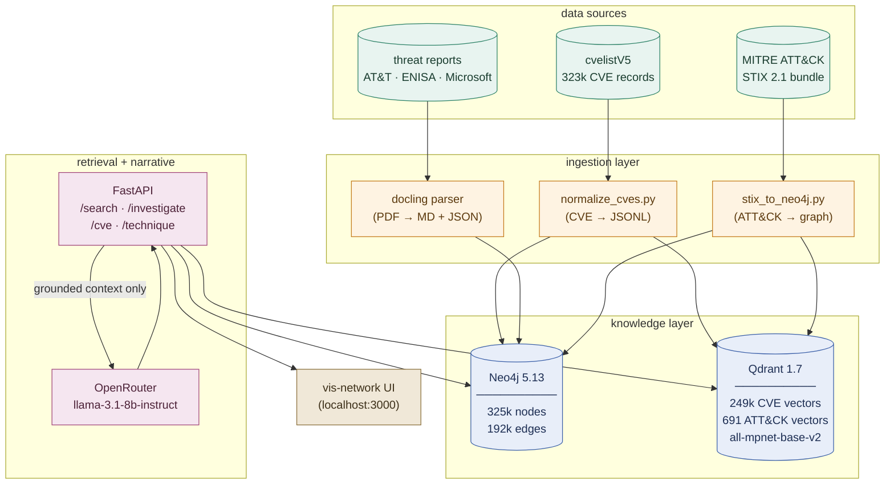
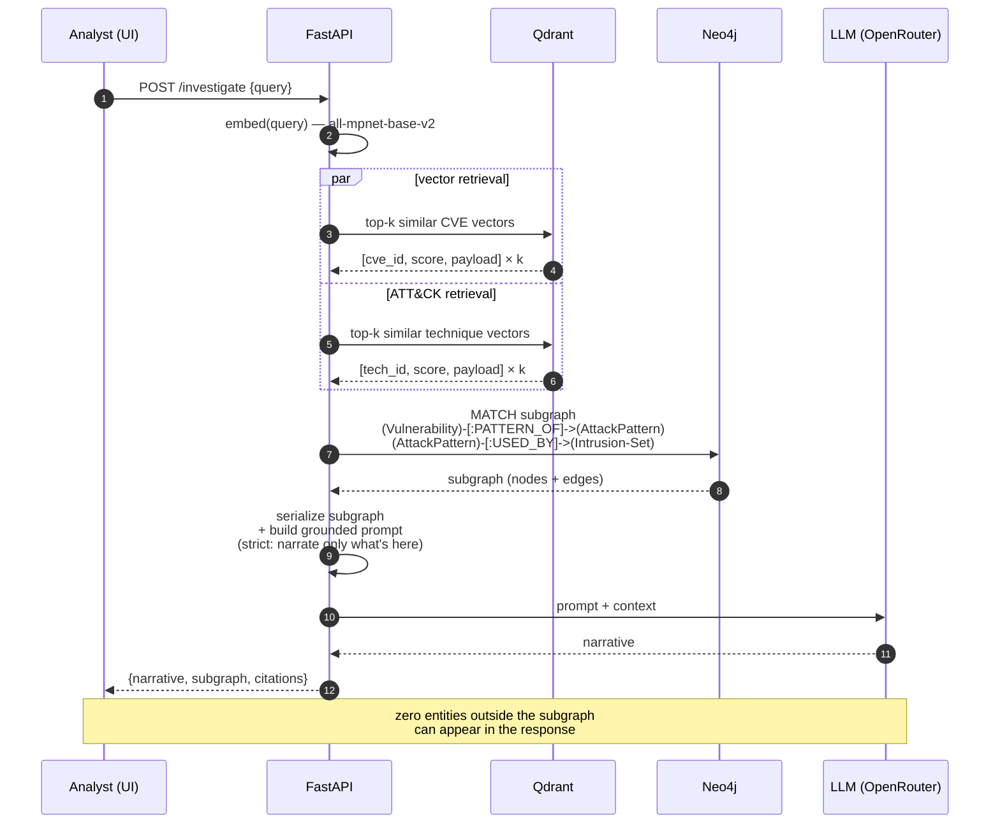
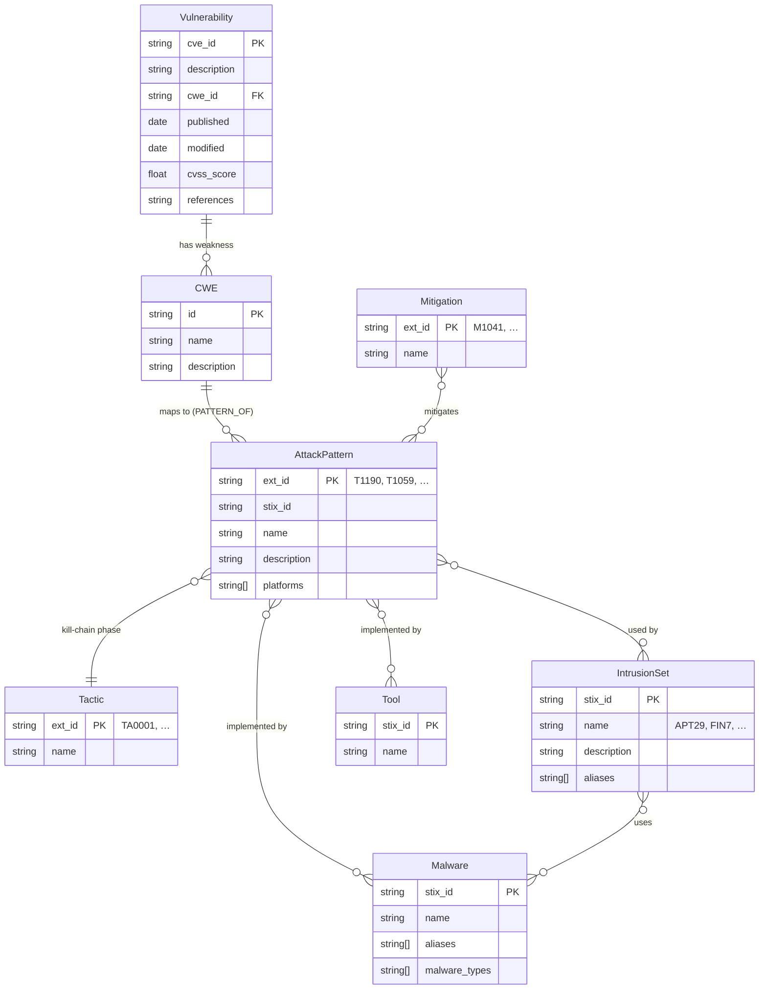

# architecture

Three diagrams, three levels of zoom.

1. **System architecture** — how the pieces fit.
2. **`/investigate` request flow** — what happens when you ask a question.
3. **Knowledge graph data model** — what's actually in Neo4j.

---

## 1. system architecture

The arrow from FastAPI to the LLM is one-way and tightly bounded: only the
subgraph retrieved from Neo4j + the top-k vector hits cross that boundary.
The LLM never sees the raw corpus.

---

## 2. `/investigate` request flow

What happens when an analyst pastes a CVE or an incident description into
the UI:

**Key invariant:** every entity name in the LLM's response must appear in
the subgraph payload. The frontend renders the subgraph in vis-network so
the analyst can visually trace any claim.

---

## 3. knowledge graph data model

What's in Neo4j after all loaders finish:

### counts (current)

| node label       | count   |
|------------------|---------|
| Vulnerability    | 323,647 |
| AttackPattern    |   ~700  |
| Tactic           |    14   |
| IntrusionSet     |   ~150  |
| Malware          |   ~700  |
| Tool             |    ~80  |
| Mitigation       |    ~45  |
| **total nodes**  | **~325,400** |

| edge type        | count   |
|------------------|---------|
| PATTERN_OF       | 174,542 |
| (ATT&CK internal) | 18,022 |
| **total edges**  | **~192,500** |

### why two stores instead of one?

Neo4j answers structural questions: *what techniques is this CVE linked to,
which APTs are known to use them, what mitigations apply?* These are graph
traversals — Cypher is the right tool.

Qdrant answers semantic similarity: *find me CVEs that look like this
incident description even if the wording is different.* These are
vector-space queries — a graph DB would be the wrong tool.

The pipeline uses both: vector hits give you the entry points into the
graph, then graph traversal expands the context. This is the "hybrid"
in hybrid search.

---

## why this shape, not RAG-over-everything?

A naive design would dump the whole corpus into a vector store and let the
LLM RAG over it. We tried this in February. It hallucinates. The model
produced confident-sounding outputs citing CVE numbers that don't exist,
attributing campaigns to wrong groups, and inventing tool names.

The fix isn't a better prompt. The fix is to make hallucination
*structurally impossible*: only feed the LLM entities that already exist as
nodes in a verified graph. If an entity isn't in the subgraph, the LLM has
no token to generate that would reference it credibly. It has nowhere to
hallucinate *to*.

This is the core design decision. Everything else follows from it.
